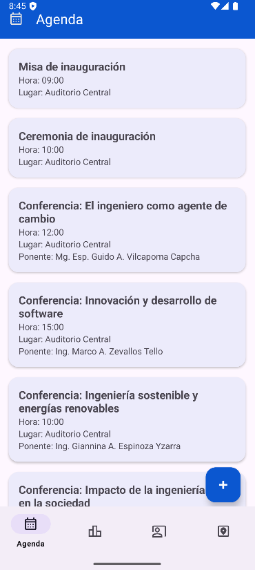
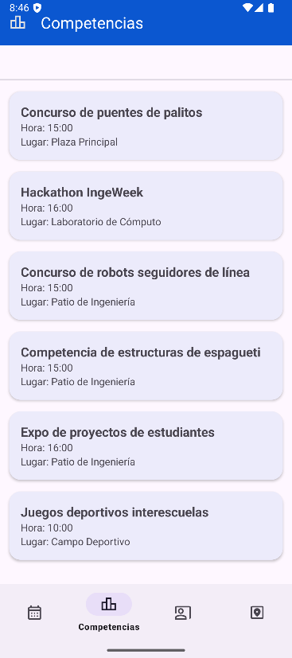
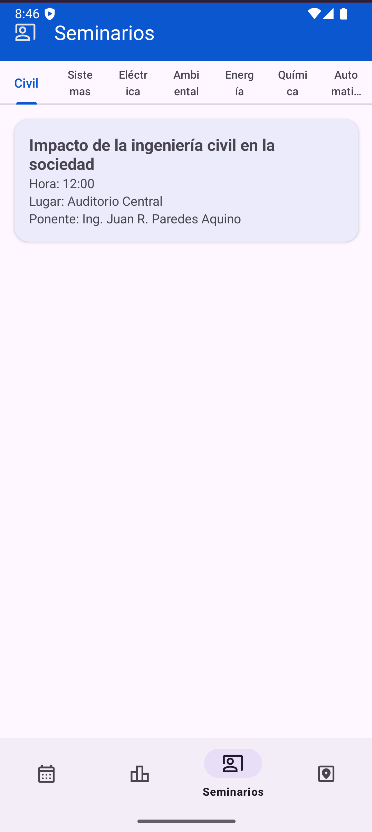
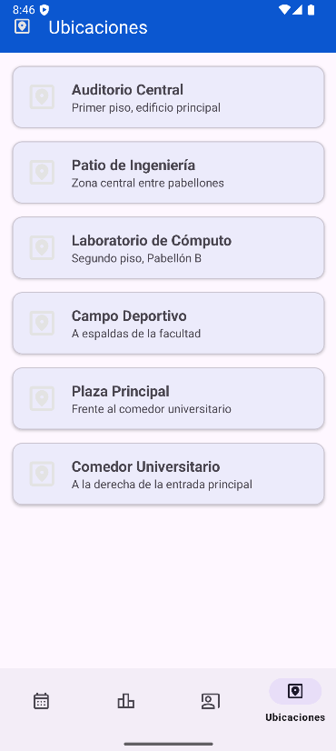

SEMANA 7
ALUMNO: LIZA GUERRERO PIERO ALEXANDRO
CODIGO: 0202114037

# IngeWeek - Semana de Ingeniería

**IngeWeek** es una aplicación móvil Android creada como proyecto académico para el curso **Aplicaciones Móviles** (Ingeniería de Sistemas), cuyo objetivo es transformar el tríptico físico de la Semana de Ingeniería en una **agenda digital interactiva**.

---

## 🚩 ¿QUÉ HACE LA APLICACIÓN?

La app **IngeWeek** permite:
- Consultar de manera intuitiva y visual la **agenda oficial** de la Semana de Ingeniería.
- Explorar las diferentes **secciones del evento**: Agenda, Competencias, Seminarios y Ubicaciones.
- Navegar entre las secciones con una **barra inferior** (BottomNavigation).
- Visualizar cada evento con **tarjetas (cards)** al estilo Material Design 3.
- Ver seminarios organizados por **escuela/profesión** con pestañas (TabLayout).
- Consultar información rápida de **ubicaciones importantes**.
- Utilizar un **botón flotante (FAB)** en la agenda (para futuras funciones como compartir, exportar, etc).

---

## 🎨 FUNCIONALIDADES Y COMPONENTES IMPLEMENTADOS

- **Material Design 3:**  
  Toda la app utiliza la última versión de Material Design (Material 3) para colores, tipografías, estilos y componentes modernos.
- **Toolbar (AppBar):**  
  Presente en todas las secciones, muestra el nombre de la sección y el ícono correspondiente.
- **Bottom Navigation:**  
  Permite cambiar entre las principales secciones: Agenda, Competencias, Seminarios, Ubicaciones.
- **RecyclerView + MaterialCardView:**  
  Toda la información (eventos, competencias, seminarios, ubicaciones) se muestra en listas con tarjetas modernas.
- **TabLayout:**  
  En la sección de Seminarios, permite filtrar los seminarios por cada escuela profesional.
- **FloatingActionButton (FAB):**  
  Botón flotante en la sección Agenda, listo para futuras acciones (actualmente muestra un mensaje de demo).
- **ViewBinding:**  
  Utilizado en todos los fragments para un acceso seguro y moderno a las vistas.
- **Arquitectura Modular:**  
  Cada sección implementada como un Fragment independiente.
- **Compatibilidad:**  
  Funciona desde Android 7.1 (API 25) hasta las versiones más recientes.

---

## 🗂️ SECCIONES DE LA APP

- **Agenda:**  
  Muestra la agenda completa de la Semana de Ingeniería, día por día, con detalle de hora, título, ponente y lugar.
- **Competencias:**  
  Lista de concursos, juegos deportivos y hackathons, con hora y ubicación.
- **Seminarios:**  
  Seminarios y conferencias, organizados por escuela profesional mediante pestañas.
- **Ubicaciones:**  
  Ubicaciones clave del evento: auditorios, laboratorios, patios, etc.

---

## 🖼️ CAPTURAS DE PANTALLA

<!-- Sube tus imágenes a la carpeta /images del repo y enlaza así: -->

  
  
  
  

---

## 🔨 CÓMO SE HIZO

1. **Proyecto creado en Android Studio con Kotlin, usando Material3 desde el inicio.**
2. **Se definió el tema personalizado** en `themes.xml` para colores y estilo.
3. **Se crearon los Fragments** para cada sección y se configuró la navegación inferior.
4. **Se implementaron los adapters y layouts** para mostrar la información en tarjetas (cards) usando RecyclerView y MaterialCardView.
5. **La agenda, competencias y seminarios** se cargaron de acuerdo al tríptico oficial, y se organizaron los seminarios en pestañas según la escuela.
6. **Se implementó el FloatingActionButton** en la agenda.
7. **Se pulió la interfaz** para cumplir los lineamientos de Material Design 3.
8. **El código es limpio, modular y fácil de mantener.**

---

## 💻 INSTALACIÓN Y USO

1. Clona el repositorio:
2. 
git clone https://github.com/PieroL1/IngeWeek.git

3. Abre el proyecto en Android Studio.
4. Sincroniza las dependencias.
5. Ejecuta la app en un emulador o dispositivo físico (Android 7.1/API 25+).

---

## ⚡ NOTAS FINALES

- App desarrollada solo con fines educativos.
- Todos los datos y secciones se adaptaron del tríptico oficial de la Semana de Ingeniería 2025.
